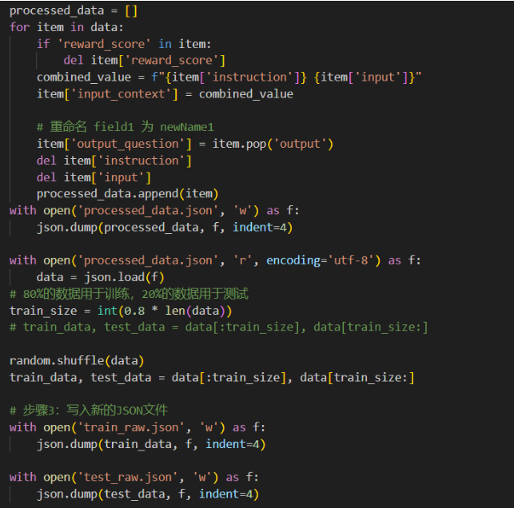

# 筛选SFT指令微调数据

# 一、摘要

如何筛选出高质量的合适LM的指令数据仍然是一个为被解决的问题，但近年来也有不少高效有用的指令筛选方法被提出，如[DEITA](https://link.zhihu.com/?target=https://mp.weixin.qq.com/s/IqwP6cfsmPNduq_5Il7pow)、CaR、MoDS和[IFD](https://link.zhihu.com/?target=https://mp.weixin.qq.com/s/zU-mmn91UhS0x8NoX2757g)等。为了进一步了解指令数据对大模型的影响与理解大模型调试与使用，我们使用面向模型的数据选择(MoDS) 方法来实现高质量指令数据的筛选。该方法基于考虑质量、覆盖范围和必要性三个方面来对原始数据集进行数据过滤，最终获取对于不同模型的高质量数据集。并且相较于自动识别方法，在使用更少数据的情况下，就可以获取更好的效果。

# 二、引言

随着深度学习技术的发展和应用，模型微调指令数据的筛选逐渐成为一个重要的研究和实践方向。在深度学习早期阶段，通常采用端到端的训练方式，即直接使用整个预训练模型并微调所有参数。此时，对指令和数据的筛选较少，主要集中在调整学习率、正则化等方面。而随着迁移学习的兴起，深度学习从头开始训练大型模型的成本较高，因此开始使用预训练的模型进行微调。在这一阶段，针对不同任务的微调需要对指令和数据进行筛选和调整，以适应不同的数据集和任务。

后面随着对深度学习模型结构和参数的研究不断深入，出现了模型解构学习的概念。通过深入分析模型中各层的作用和影响，可以有针对性地调整指令和数据，以优化模型效果。并随着自动化调参技术的不断发展，如超参数优化和神经网络搜索等方法的应用，深度学习模型的微调过程变得更加智能和高效。这些技术可以自动化地进行指令和数据的筛选，并寻找最佳的参数配置。

在当前阶段，越来越多的研究开始关注模型的不确定性建模，以提高模型的鲁棒性和准确性。在大模型微调中，筛选和调整指令数据也需要考虑模型的不确定性，并相应地进行调整。

总的来说，大模型微调指令数据的筛选在深度学习领域的发展经历了从简单的微调到智能化自动化调优的过程。随着技术的不断发展和方法的不断创新，大模型微调的指令数据筛选也在不断演进，为深度学习模型的优化提供更多可能性。

# 三、方法

MoDS方法主要通过质量、覆盖范围、必要性三个指标来进行数据的筛选，其中数据质量是为了保证所选的指令数据的问题和答案都足够好；数据覆盖范围是为了让所选择的数据中指令足够多样、涉及知识范围更广；数据必要性是选择对于大模型较复杂、较难或不擅长的数据以填补大模型能力的空白。

MoDS方法步骤可分为以下三个方面：

1. 质量筛选：

在评估数据质量时，采用OpenAssistant的reward-model-debertav3-large-v2模型对数据进行质量打分。这是一个基于DeBERTa架构设计的奖励模型，并在四种不同类型的人类反馈数据上进行了训练，赋予其QA模型评估、奖励评分和通过排名检测潜在毒性反应的能力。在这里我们主要用的是它的奖励评分能力，使用它对原始数据的Instruction、Input、Output的三个部分的拼接进行打分。当评分超过α时，我们认为数据质量达标，并将达标数据构建一份高质量数据集。

 

质量筛选流程

 

质量评估模型输入与输出

 

 

2. 多样性筛选：

在获得高质量的指令数据集后，我们将进一步从中选择数据。为了选择覆盖范围最大的多样化指令数据，我们使用K-Center贪心算法进行数据筛选。K- Center问题的目标是从给定的数据点集中选择K个彼此距离最大的子集，这些子集的中心数据构成的集合便是在最大化多样性的情况下最小的指令数据集，即种子指令数据集。

 

多样性筛选流程

多样性筛选伪代码

 

 

3. 必要性筛选：

不同的大型语言模型进行指令微调时，所需的指令数据也需要不同。对于一条指令，如果给定的大型语言模型本身能够生成较好的回答，则说明给定的大型语言模型具有处理该指令或者这类指令的能力，反之则说明大模型还需要这方面的数据继续进行训练。

 

为了得到这方面的数据，我们需要大模型对我们的数据进行预测，并找到其不能很好预测的数据。那么首先我们将种子数据集对模型进行初始训练，并用训练好的初始模型对整个高质数据集中的指令进行结果预测。之后利用奖励模型对模型预测的结果进行评分，当分值小于β时，说明初始模型不能对这些指令生成优质的回复，不具有处理这些类型指令的能力，获取必要性数据集。

  

必要性筛选流程

 

四、实验

 

1. 数据集介绍

我们选择的是斯坦福52K英文指令数据集，其中指令中的每一条都是唯一的,答案由text-davinci-003模型生成得到的。

开源地址：https://github.com/tatsu-lab/stanford_alpaca

斯坦福Alpaca数据集（羊驼数据集）

 

2. 指令数据筛选

 

首先，我们使用OpenAssistant的reward-model-debertav3-large-v2模型作为质量评估模型对数据进行打分。将原始指令数据集中的指令、输入拼接作为问题，输出作为答案，分组送入质量评估进行评估打分，从中过滤出高质量子集。

 

质量筛选指令数据拼接

质量筛选运行过程

 

然后利用k中心贪婪算法从高质量子集中进一步选择覆盖率好的种子指令数据集。这种k中心贪心算法可以选择距离最远的数据点子集，从而使得我们收集的指令数据多样化，覆盖范围更广。这里的距离算得是instruction间的距离。

 

多样性筛选

 

K-Center聚类

其中需要注意的是，我们采用 [bert-base-uncased](https://huggingface.co/bert-base-uncased) 模型使用BERT模型对每个文本序列进行编码,提取其语义向量，为指令数据生成句向量来计算不同数据之间的距离。

 

BERT模型提取其语义向量

 

多样性筛选运行结果

最后种子数据集用于微调基础LLM，利用复杂度评价模型，找出高质量数据指令中在LLM上执行差的数据指令，从而得到必要指令集。通过这种方式，我们可以从原始指令数据集中得到一个小的、高质量、广覆盖、高需求的子集。

3. 模型微调与指令数据增强

上面筛选出的数据都是我们根据先验知识来筛选的，并不知道实际用于微调模型之后效果如何，所以如果能够使用它们微调数据，然后让模型推理，模型得分比较低的一些指令我们补充到筛选指令集中，可能会有更好的效果。

在这一部分，将使用必要性筛选出来的多样性数据集seed_instruction.json进行flan-t5-large模型微调，然后使用高质量筛选数据集high_quality.json进行推理，最后再进行质量评分，将得分低的数据补充到seed_instruction.json中作为我们的结果。具体流程如下图

 

t5模型（Text-To-Text Transfer Transformer）是一个较小的同时也适合指令微调的模型。一般而言，指令微调都会选择llama模型，但是由于llama模型需要权限（申请的时候写区域为中国结果被ban了），以及它需要更多的资源和时间，所以转而寻找较小的模型。我们发现并不是所有的模型都适合指令微调，比如gpt-2似乎只有自回归式的微调方法，实际上相当于是模型直接微调。t5模型因为其encoder-decoder架构所以适合在encoder端输入问题，在decoder端输入答案，进行指令微调。

另外flan-t5就是t5的指令微调版本，证明比t5表现好很多，所以我们预期对它继续进行指令微调可以有较好的结果。 

首先是数据方面，采用HuggingFace的datasets库中load_dataset方法加载数据集，要求将数据构造为train.json和valid.json.将我们的数据字段改变，input=instruction+input，output=output，然后删掉reward。

 

 

然后encode我们的数据：encode之后有四个字段：input_id,attention_mask,label,decoder_attention_mask，然后在tokenizer中去除掉没有出现的token部分，以减少我们的tokenizer大小和模型大小，接着在训练的部分还可以resize我们的embedding层，以减少模型大小。

 

以下是加载模型和我们保存的tokenizer之后，resize模型的embedding层的方法：

 

接下来配置训练的参数。我们使用了deepspeed训练框架。我们配置了训练批次大小为16，并启用了梯度累积步数为2来模拟更小的批次训练；使用fp32作为通信数据类型；应用了ZeRO的第1阶段优化技术并卸载优化器到CPU以节省GPU内存；采用了Adam优化器，配置了学习率、betas、eps和权重衰减等参数；使用了WarmupLR学习率调度器，其中预热阶段从0增加到0.001；启用了bf16数据类型以提高训练速度和精度；同时启用了CUDA图以优化GPU计算，并计划使用Triton技术；最后，我们设置了梯度裁剪值为1.0以防止梯度爆炸。

 

接下来开始训练部分，由于使用了deepspeed，所以不必特意指出optimizer，直接使用model.backward(cur_loss)即可，

 

 

然后这是总体的训练pipeline:

 

接下来是推理部分，使用第一步得到的高质量数据high_quelity.json进行推理相比于训练部分，只有前向传播没有反向传播，最后把问题和答案都decoder一下保存进infer.json中，用于后续的分析。 

最后我记录下来了这次在服务器上进行模型训练的debug心得在我的typora笔记中，感触就是在ubuntu上进行深度学习环境相对好配一些，但是也需要熟练各种指令，希望下次能做的更好。

 

 

另外，我使用未经微调的flan-t5-large进行推理，将结果保存在infer_pre.json中，我们可以看到微调之后的明显进步：

微调前生成例子：

 

 

微调后生成例子

 

我们将这两批数据进行质量打分，得到频率直方图

最后，我们把微调后模型生成的数据中，得分最低的500条指令和标准回答加入进我们的结果中，进行数据增强。

4. 数据格式转化

需要注意的是，我们使用的斯坦福52K英文指令数据集中数据的格式为包含instruction、input、output三个元素的字典，而要求的数据格式为每⾏为⾄少包含“messages”关键字的字典，对应的值为多轮对话的列表，其中元素为字典，包含"role"和"content"两个关键字，前者的值为⾓⾊ （“user”或 "assistant"），后者的值为对应的内容（⽤户指令或者模型输出） 如{"messages": [{"role": "user", "content": "Ins1"},{"role": "assistant", "content": "res1"}]}，因此我们需要对得到的高质量数据集进行一次格式转化以让其适应要求。其中instruction和input都对应为user角色所提出的问题，而output则为assistant角色所给出的回答，但由于不是每条数据都有input输入，所以针对两种情况分别进行不同的格式转化。若存在input输入，则额外增加一条acknowledged输出作为回答，即将其当作多轮对话的情况；若不存在input输入，则output直接作为instruction的回答输出。

高质量数据集的数据格式转换

 

数据转换结果部分截图

# 五、结论

1. 数据质量

下图为reward-model-debertav3-large-v2模型对指令数据的质量打分的柱状图。从中我们可以看到数据得分的分布情况，并以此确定高质量数据的分数标准线。

 

指令数据质量评估的分数段柱状图

 

2. 模型提升